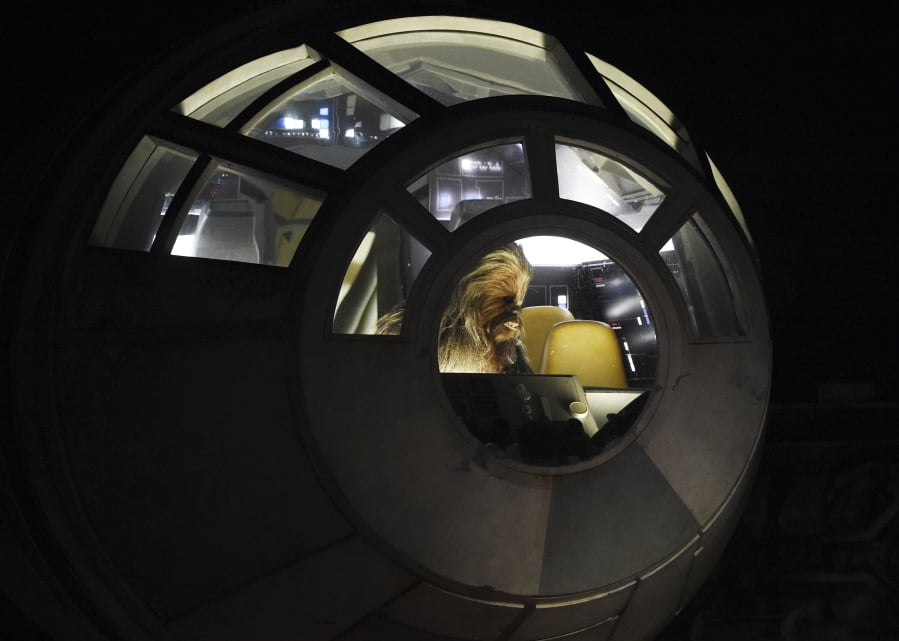

# ⭐ Sparta Starships Project ⭐

🤖🌠🤖⭐🤖🌠🤖⭐🤖🌠🤖⭐🤖🌠🤖⭐🤖🌠🤖⭐🤖🌠🤖⭐🤖🌠🤖⭐🤖🌠🤖⭐🤖🌠🤖⭐🤖🌠🤖⭐

This project adds a starship collection to the starwars character DB in Mongo. Within that collection, the pilot URLS associated with each starship are replaced with the local Object ID linked to the character in the MongoDB, to support a referenced database model. 

  
    

                                   🤖🌠🤖⭐

# Contents
  

### Within this project you will find the following sections: 

- 🌠 <a href= "https://github.com/Yuvraj-26/Sparta-Starship-Project/blob/dev/main.py">Main: everything you need to run the program

- 🌠 <a href= "https://github.com/Yuvraj-26/Sparta-Starship-Project/blob/dev/swapi.py">API Section: requests & communications with the SWAPI (StarWars API)

- 🌠 <a href= "https://github.com/Yuvraj-26/Sparta-Starship-Project/blob/dev/mongodb.py">MongoDB Pipeline: functions to run the pipeline to MongoDB

- 🌠 <a href= "https://github.com/Yuvraj-26/Sparta-Starship-Project/blob/dev/tests.py">Testing Suite: to check all is as it should be

### We used a Kanban board in Trello to manage this project. 

# <a href= "https://trello.com/invite/b/aL4x7i8X/ATTI3dd123dc4baf0b155ce0f8377a6751d6F117B952/star-wars-sparta-project">Check it out here!

                                      🤖🌠🤖⭐

# Testing Report

For our testing, we first defined the kinds of tests required to give a functioning overview of the code. This was determined by our user stories and gherkin scripts. We broke our units tests into two distinct criterias: those testing the api requests and those testing the MongoDB pipeline. The primary function used to test these relationships was the “assert” function.

We respected the red-green refractory cycle of TDD by writing the tests prior to compiling code. Where we strayed from this method was that these tests were adjusted slightly after initial code was written in the first sprint. Obvious limitations in our following the TDD method were that due to time constraints in the project the tests were written in conjunction with the code so there was an evident need for adaption of the tests. However, in the long-run the tests proved invaluable for assuring edits to the code didn't break things, and that the end program worked as it should.

